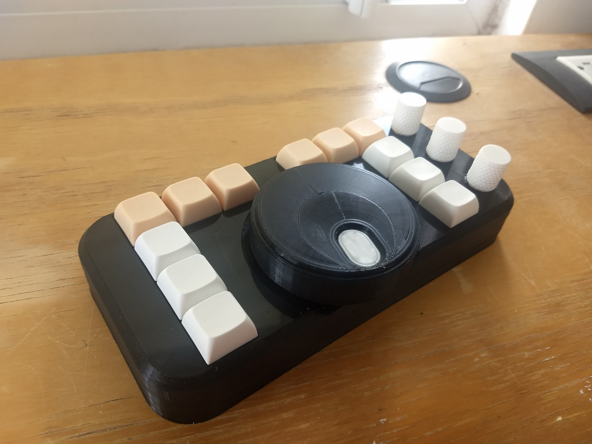

# Video Controller Surface

Simple surface for video editing utilizing a Teensy 2.0 It's main purpose is to be utilized with the program 
Adobe Premiere Pro. However, thanks to the Teensy's HID interface, can also be utilized as a multipurpose 
Macro pad.

This surface has 12 buttons, a main central knob, and 3 secondary knobs. The four knobs also have buttons.

This project is heavily based by Zack-Freedman's [Big-Wheel](https://github.com/ZackFreedman/Big-Wheel) 
project.

## Repository structure
The repository is divided in four subfolders, each containing a different part of the project. Further 
documentation can be found inside these folders.

1. [**Assembly**](/Assembly) - This folder contains the files that make up the physical device. They are 
available in .SLDPRT and .STL formats.

2. [**Firmware**](/Firmware) - This folder contains the Firmware utilized by the device. It is built in 
platform.io and uses the [Teensyduino](https://www.pjrc.com/teensy/td_download.html) library.

3. [**Schematics**](/Schematics) - This folder contains the wiring diagrams, as well as the elements to 
manufacture a PCB for it.

4. [**Shortcut-Profiles**](/Shortcut-Profiles) - This folder contains .kys files for Adobe Premiere.

## Future improvements
The improvements are separated by category inside the documentation for each folder.

## Credits
- Jose Tow [[@Tow96](https://github.com/Tow96)]

Original idea from: Zack Freedman ([github](https://github.com/ZackFreedman), 
[youtube](https://www.youtube.com/channel/UCUW49KGPezggFi0PGyDvcvg))

## License
This project is licensed under [MIT license](/LICENSE) as I believe in open-source, specially when basing 
your project from another.