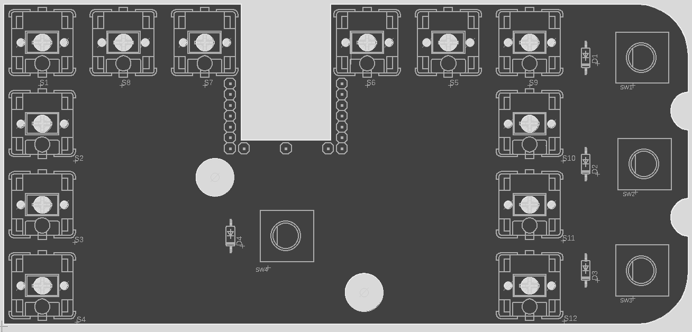

# Schematics
This folder contains the wiring diagrams, as well as the elements to manufacture a PCB for it.

The files are in EAGLE CAD format and also the gbr files are available to manufacture a PCB out of it.

**Warning:** The PCB has tolerances to fit inside the body of the device, and test prints have 
been made to check if the components fit. However a proper PCB hasn't been manufatured to test

## Teensy pins
The pins to which each component is wired can be changed on the [pins.h](../Firmware/src/pins.h) 
file. The default connections are:

Wire      | Pin
--------- | ---
Row A     | 5
Row B     | 6
Row C     | 16
Row D     | 15
Col 1     | 17
Col 2     | 18
Col 3     | 3
Col 4     | 4
TopKnob A | 8
TopKnob B | 7
MidKnob A | 10
MidKnob B | 9
BotKnob A | 13
BotKnob B | 14
Wheel A   | 11
Wheel B   | 12

## Hand soldering
The case is also designed to be hand soldered instead of using a pcb. Here is the name of each button and knob matching the schematics.

